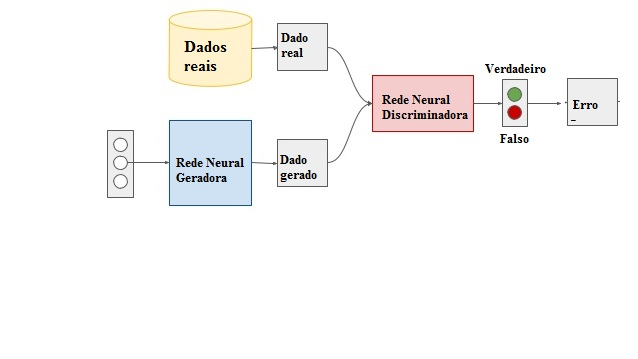
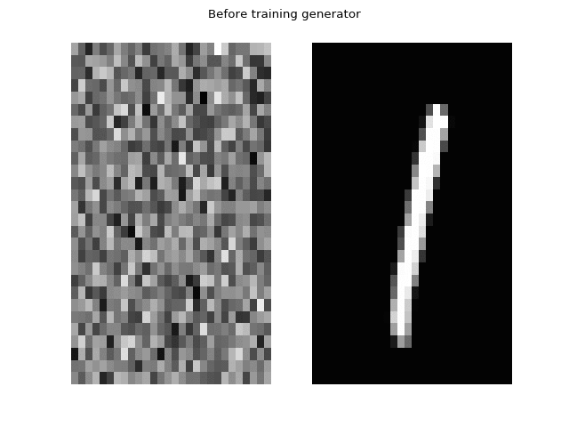
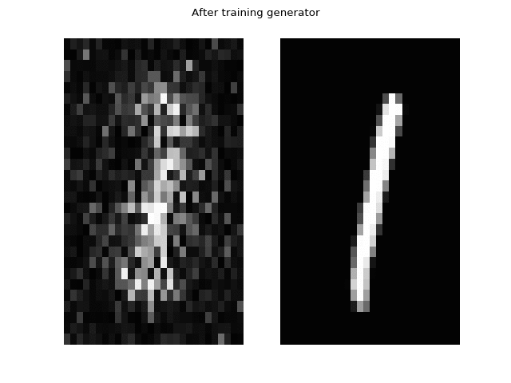

# GAN-Generative-Adversarial-Networks-Parte-I

[](http://www.datah.com.br)
[](http://www.deeplearningbrasil.com.br)


# Introdução 

Arquiteturas de redes neurais Generativas (ou geradoras) possuem como principal característica a habilidade de "aprender' a criar dados artificiais que são semelhantes a dados reais. A premissa básica é: "O que você não consegue criar, não consegue entender". Entretanto, seu entendimento e uso ainda não se apresentam como uma tarefa fácil. Neste post pretendemos descrever a formulação da GAN e fornecer um breve exemplo com código no TensorFlow para um problema relativamente simples e de fácil compreensão.

## Ambiente de codificação

O código deste exemplo foi testado no Linux Ubuntu 14 

* Python 2.7
* tensorflow (1.0) - Para versões < 1, descomente a linha 90 e comente a linha 92.
* matplotlib
* numpy
* scipy
* seaborn

Para executar:
* python2 gan.py --num-steps 1000 --minibatch True

## Compreendendo a Arquitetura

A ideia da arquitetura GAN foi introduzida pela primeira vez em 2014 por um grupo de pesquisadores da Universidade de Montreal liderado por Ian Goodfellow (atualmente na OpenAI). A arquitetura básica é composta por duas redes neurais concorrentes conforme ilustrado abaixo:




Uma rede neural (chamada de geradora) toma "ruído" como entrada e gera dados em sua saída. A outra rede neural (chamada de discriminadora) recebe dados tanto da rede geradora quanto de dados reais de treinamento. A rede discriminadora deve ser capaz de distinguir entre as duas fontes, rotulando a informação como real ou sintética (falsa). Estas duas redes praticam um "jogo" contínuo, onde o gerador está aprendendo a produzir dados cada vez mais realistas, e a discriminadora está aprendendo a distinguir dados sintéticos de dados reais. Essas duas redes são treinadas simultaneamente com o objetivo de que a competição conduza a situação de que os dados sintéticos se tornem  indistinguíveis dos dados reais.

## Explicação modo "Easy"

Vamos utilizar o episódio No Weenies Allowed (Não adimitimos piralhos - tradução livre) do desenho Bob Esponja para explicar como funciona as GAN's. A função do segurança do clube (nosso discriminador GAN) é permitir a entrada somente de "caras fortes" e negar a entrada de "piralhos" curiosos. 


.

O segurança (D - discriminador) barra Bob Esponja (G - Gerador) por considerá-lo fracote. De fato Bob Esponja (G) é um imitador. Ele precisa se asemelhar o máximo possível para enganar o segurança. 


Bob esponja, tenta de todas as formas se disfarçar, alterando a sua aparência de modo a ficar similar aos indivíduos que adentram o clube para tentar "enganar" o segurança. O segurança em um primeiro momento observa aspectos óbvios que discrimine as duas categorias, cabe a Bob Esponja (G) imitar esses aspectos óbvios para não ser reconhecido. Uma vez que o discriminador (D) definiu algum aspecto como importante (a força, por exemplo), o gerador (G) usará essa informação para tentar "enganar" o discriminador.


O episódio segue com Bob Esponja (G) tentando exibir/imitar características que tentam enganar o segurança (D). Fazendo uma analogia com as imagens do desenho, é possível ilustrar na figura abaixo o funcionamento das redes. O geradaor terá números randômicos como entrada e produzirá imagens que serão avaliadas por uma rede de discriminação que determinará se a imagem é falsa ou real.


## Explicação modo "Hard"

Se você não tem medo de matemática, vamos direto ao ponto. As redes GAN podem ser resumidas pela equação abaixo:


Mas calma... se não entendeu, vamos compreendê-la.

O gerador (G) e o driscriminador (D) geralmente são redes neurais do tipo "feedforward". A primeira parcela  expressa que o discriminador (D) irá buscar os parâmetros da rede que a levem a discriminar entre dados reais e sintéticos. Já na segunda parcela , o gerador (G) terá como objetivo gerar saídas que o discriminador (D) considere como real. A entrada z, é um vetor de ruídos de uma distribuição . O discriminador recebe como entrada um conjunto de dados real (x) ou gerado (G(z)), e produz como saída uma probabilidade da entrada ser real P(x).

Ambas as partes das equações podem ser otimizadas de forma independente com métodos baseados em gradientes. Primeiro, faça um passo para maximizar o discriminador (D) , depois faça um passo para otimizar o gerador (G) de modo a minimizar  a separação encontrada pelo discriminador (D). Em termos práticos, estamos seguindo uma regra min-max da teoria dos jogos, uma rede joga contra a outra. 


## Exemplo prático:

Para entender melhor como tudo isso funciona, usaremos um GAN para resolver um problema didátio usando o framework TensorFlow. O desafio é um "toy problem". A rede neural deverá ser capaz de aproximar uma distribuição Gaussiana unidimensional. O código-fonte completo está disponível em nosso Github ( https://github.com/deeplearningbrasil/gan-generative-adversarial-networks-parte-I/gan.py ). Neste texto vamos focar nas partes mais importantes do código.

Primeiro criamos o conjunto de dados "real", um curva gaussiana simples com média igual a 4 (quatro) e desvio padrão de 0,5. Para isso, implementamos a função abaixo na linguagem python, que retorna um determinado número de amostras da distribuição de dados (gaussiana).

```python
class distribuicaoDados(object):
    def __init__(self):
        self.media = 4
        self.desviopadrao = 0.5
        
    def amostras(self, N):
        amostras = np.random.normal(self.memdia, self.desviopadrao, N)
        amostras.sort()
```


Definiremos também os dados de entrada para a rede neural geradora, utilizando a mesma função de distribuição de dados, porém, perturbando os dados com ruído artificial. 


```python
class distribuicaoDados(object):
    def __init__(self, range):
        self.range = range

    def amostras(self, N): 
       return np.linspace(-self.range, self.range, N) + np.random.random(N)  0.01
```
   
Nosso gerador, por simplicidade deste exemplo, não será uma rede neural propriamente dita. Será uma função linear, seguida por uma não-linear e por fim uma nova função linear, conforme codificado abaixo.

```python
def gerador(input, hidden_size):
    passo1 = linear(input,hidden_size,'g0')
    passo2 = tf.nn.softplus(passo1)
    passo3 = linear(passo2, 1, 'g1')
    return passo3            `
```
    
Neste caso, é importante que o discriminador seja mais "poderoso" do que o gerador, ou então, corremos o risco de que ele não tenha capacidade suficiente para distinguir entre os dados sintéticos e os reais. Logo, vamos definir uma rede neural com funções tanh (não-lineares) em todas as camadas, exceto na final, que conterá uma função sigmóide que irá gerar valores entre 0 e 1 que podem ser interpretados como o resultado de probabilidade de ser verdadeiro (valor 1) ou falso (valor 0).

```python
def discriminador(input, h_dim, minibatch_layer=True):
    passo1_h0 = linear(input,h_dim*2,'d0')
    passo2_h0 = tf.tanh(passo1_h0)
    passo1_h1 = linear(passo2_h0,h_dim*2,'d1')
    passo2_h1 = tf.tanh(passo1_h1)
```
    
Agora podemos colocar as funções já desenvolvidas em um "TensorFlow graph" e também definir uma função de "perda" , geralmente chamada de "loss" nos artigos científicos (relação entre o que se espera e o que foi obtido), tendo como alvo a situação em que o discriminador não seja capaz de distinguir entre o dado sintético e o verdadeiro.

```python
        with tf.variable_scope('Gen'):
            self.z = tf.placeholder(tf.float32, shape=(self.batch_size, 1))
            self.G = gerador(self.z, self.mlp_hidden_size)

        with tf.variable_scope('Disc') as scope:
            self.x = tf.placeholder(tf.float32, shape=(self.batch_size, 1))
            self.D1 = discriminador(self.x, self.mlp_hidden_size, self.minibatch)
            scope.reuse_variables()
            #cria uma segunda rede de discriminacao, pois no tensorflow nao seria 
            #possivel uma rede com duas entradas diferentes
            self.D2 = discriminador(self.G, self.mlp_hidden_size, self.minibatch)
            
        self.loss_d = tf.reduce_mean(-tf.log(self.D1) - tf.log(1 - self.D2))
        self.loss_g = tf.reduce_mean(-tf.log(self.D2))
```

Criamos funções de otimização para cada rede usando o critério de GradientDescentOptimizer do TensorFlow com taxa de aprendizado com decaimento exponencial. Note que existem alguns conceitos envolvidos aqui. O completo entendimento e compreensão dos parâmetros de otimização requer alguma experiência prévia com otimização e de redes neurais artificiais.

```python
    def otimizador(erro, var_list, taxa_aprendizado_inicial):
        decaimento = 0.95
        qtd_passos_decaimento = 150
        batch = tf.Variable(0)
        learning_rate = tf.train.exponential_decay(
            taxa_aprendizado_inicial,
            batch,
            qtd_passos_decaimento,
            decaimento,
            staircase=True
        )
        otimizador = tf.train.GradientDescentOptimizer(learning_rate).minimize(
            erro,
            global_step=batch,
            var_list=var_list
        )
        return otimizador
```
    
Para treinar a GAN, obtém-se pontos da distribuição de dados e da distribuição sintética e alternamos entre otimizar os parâmetros do discriminador e do gerador.

 ```python
        def train(self):
        with tf.Session() as session:
            tf.global_variables_initializer().run()

        for step in xrange(self.num_steps):
            # atualiza o discriminador
            x = self.data.sample(self.batch_size)
            z = self.gen.sample(self.batch_size)
            loss_d, _ = session.run([self.loss_d, self.opt_d], {
                self.x: np.reshape(x, (self.batch_size, 1)),
                self.z: np.reshape(z, (self.batch_size, 1))
            })

            # atualiza o gerador
            z = self.gen.sample(self.batch_size)
            loss_g, _ = session.run([self.loss_g, self.opt_g], {
                self.z: np.reshape(z, (self.batch_size, 1))
            })
```

O vídeo abaixo mostra a sequência de épocas de treinamento em que a rede geradora tenta aprender a imitar a distribuição real dos dados durante o treinamento. É possível notar que no início, a rede geradora produz uma distribuição muito distinta da real. Com o treinamento a rede consegue gerar uma distribuição similar a real.

Video:
<a href="http://www.youtube.com/watch?feature=player_embedded&v=Z-9DWDnT9lA
" target="_blank"></a>


Talvez um dos fatos mais instigantes das redes GAN's esteja no fato de que as redes competem entre si pelo melhor resultado, porém, só o conseguirão em caso de equilíbrio entre o resultado de ambas. A figura abaixo mostra a evolução da função de erro ou perda nas primeiras gerações. A medida que uma rede melhora o seu resultado o da outra piora. Este "ponto de equilíbrio" atualmente é o maior desafio em aberto no processo de treinamento deste tipo de rede neural.


## Considerações Finais

Redes GAN apresentam-se como uma ideia bastante interessante, dando-nos uma nova abordagem no processo de aprendizagem. As aplicações  bem sucedidas de GANs ainda estão em problemas de visão computacional. O critério de parada do processo de treinamento ainda é um problema em aberto. Em aplicações de visão computacional podemos olhar para as imagens geradas e fazer um julgamento se a solução é satisfatória, contudo, em outros tipos de aplicações, esse tipo de observação não é trivial.

Apesar destas limitações e dificuldades, a comunidade científica em geral está bastante animada em razão da premissa básica de que, conseguimos entender aquilo que conseguimos gerar, logo, os primeiros passos foram dados para que em breve tenhamos redes neurais artificiais que de fato consigam aprender "sozinhas" a partir de uma base de conhecimento. Nessa situação, podemos imaginar por exemplo, redes neurais que escrevem textos a partir de um simples depósito de coletâneas de artigos em sua base de dados ou que componham músicas a partir de uma biblioteca digital qualquer. Por fim, diria que a GAN é um touro arisco em processo de domesticação, quem conseguir o feito certamente levará o grande prêmio. Façam suas apostas.

Na parte II vamos detalher o código para gerar imagens sintéticas, como por exemplo, dos resultados abaixo:




Elaborado por: Anderson Soares ( www.inf.ufg.br/~anderson )
